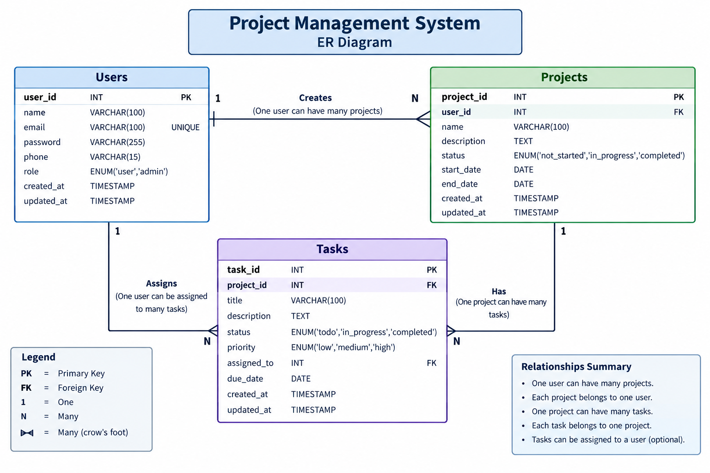

# Project Management System

A full-stack **Project Management System** designed to help users manage projects, tasks, deadlines, and progress in one centralized application.

The system provides secure user authentication and allows users to create and manage their own projects and tasks efficiently.

## Live Demo

### Frontend

https://project-management-system-psi-two.vercel.app/

### Backend API

https://project-management-system-m4g4.onrender.com

The frontend is deployed on **Vercel**, the backend is deployed on **Render**, and the database is hosted using **Aiven MySQL**.

---

## Tech Stack

### Frontend

* React.js
* Vite
* Axios
* React Router

### Backend

* Node.js
* Express.js

### Database

* MySQL
* Aiven MySQL Cloud Database

### Authentication & Security

* JSON Web Token (JWT)
* bcrypt
* express-validator
* Rate Limiting

### Other Tools

* Morgan
* Git
* GitHub
* Vercel
* Render

---

## Features

### Authentication

* User registration
* User login and logout
* Password hashing using bcrypt
* JWT-based authentication
* Protected routes
* Authentication rate limiting
* Duplicate email validation

### Project Management

* Create projects
* View projects
* Update projects
* Delete projects
* Search projects by name
* Filter projects by status
* Manage project start and end dates

### Task Management

* Create tasks
* View tasks
* Update tasks
* Delete tasks
* Assign tasks to projects
* Search tasks by name
* Filter tasks by status
* Filter tasks by priority
* Mark tasks as completed
* Manage task due dates

### Dashboard

The dashboard provides an overview of project and task progress, including:

* Total Projects
* Total Tasks
* Completed Tasks
* Pending Tasks
* Projects In Progress

---

## Project Structure

```text
project-management-system/
│
├── frontend/                 # React frontend
├── backend/                  # Node.js and Express backend
├── database/
│   ├── schema.sql            # Database schema
│   └── er-diagram.png        # ER diagram
│
├── docs/
│   └── API.md                # API documentation
│
├── .gitignore
└── README.md
```

---

## Database Design

The application uses three main tables:

* Users
* Projects
* Tasks

### Relationships

* One user can have many projects.
* Each project belongs to one user.
* One project can have many tasks.
* Each task belongs to one project.

### ER Diagram



---

## ⚙️ Local Installation

### 1. Clone the Repository

```bash
git clone https://github.com/Athi0810/project-management-system.git
```

Move into the project folder:

```bash
cd project-management-system
```

---

## 🔧 Backend Setup

Move to the backend folder:

```bash
cd backend
```

Install dependencies:

```bash
npm install
```

Create a `.env` file inside the backend folder:

```env
PORT=5000

DB_HOST=localhost
DB_USER=root
DB_PASSWORD=YOUR_MYSQL_PASSWORD
DB_NAME=project_management_db
DB_PORT=3306

JWT_SECRET=YOUR_SECRET_KEY
JWT_EXPIRES_IN=1d
```

Start the backend:

```bash
npm start
```

The backend will run at:

```text
http://localhost:5000
```

---

## Frontend Setup

Open another terminal and move to the frontend folder:

```bash
cd frontend
```

Install dependencies:

```bash
npm install
```

Start the development server:

```bash
npm run dev
```

The frontend will run at:

```text
http://localhost:5173
```

---

## Deployment

The application is deployed using cloud platforms:

| Service  | Platform    |
| -------- | ----------- |
| Frontend | Vercel      |
| Backend  | Render      |
| Database | Aiven MySQL |

### Production Frontend

https://project-management-system-psi-two.vercel.app/

### Production Backend

https://project-management-system-m4g4.onrender.com

The production frontend communicates with the backend through the deployed API.

---

## 🔌 API Endpoints

### Authentication

| Method | Endpoint             | Description         |
| ------ | -------------------- | ------------------- |
| POST   | `/api/auth/register` | Register a new user |
| POST   | `/api/auth/login`    | Login user          |
| POST   | `/api/auth/logout`   | Logout user         |

### Projects

| Method | Endpoint            | Description       |
| ------ | ------------------- | ----------------- |
| GET    | `/api/projects`     | Get all projects  |
| POST   | `/api/projects`     | Create a project  |
| GET    | `/api/projects/:id` | Get project by ID |
| PUT    | `/api/projects/:id` | Update a project  |
| DELETE | `/api/projects/:id` | Delete a project  |

### Tasks

| Method | Endpoint         | Description    |
| ------ | ---------------- | -------------- |
| GET    | `/api/tasks`     | Get all tasks  |
| POST   | `/api/tasks`     | Create a task  |
| GET    | `/api/tasks/:id` | Get task by ID |
| PUT    | `/api/tasks/:id` | Update a task  |
| DELETE | `/api/tasks/:id` | Delete a task  |

### Dashboard

| Method | Endpoint         | Description              |
| ------ | ---------------- | ------------------------ |
| GET    | `/api/dashboard` | Get dashboard statistics |

For complete API documentation, see:

```text
docs/API.md
```

---

## Security

The application includes the following security features:

* Passwords are securely hashed using bcrypt.
* JWT is used for user authentication.
* Protected APIs require authentication.
* Users can access only their own projects and tasks.
* Input validation is implemented using express-validator.
* SQL queries use parameterized values.
* Authentication endpoints are protected using rate limiting.
* Sensitive environment variables are stored securely and excluded from GitHub.

---

## Error Handling

The application handles:

* Validation errors
* Authentication errors
* Authorization errors
* Duplicate email registration
* Resource not found errors
* Server errors
* Frontend loading states
* Frontend error states

---

## Future Improvements

* Pagination
* Advanced sorting
* Automated testing
* Docker support
* CI/CD pipeline
* Audit logs
* Role-based access control
* Email notifications
* File attachments for projects and tasks

---

##  Author

**Athithyan S**
